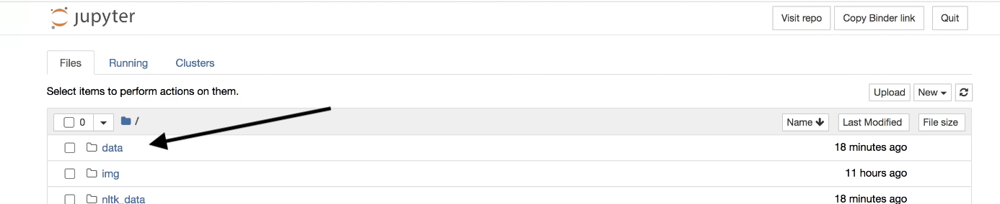
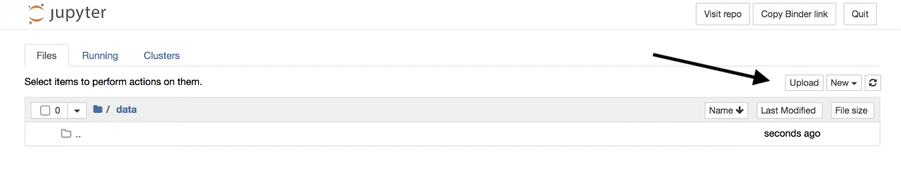
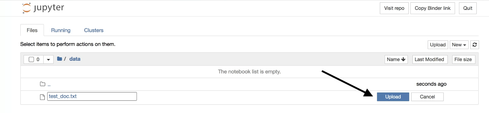
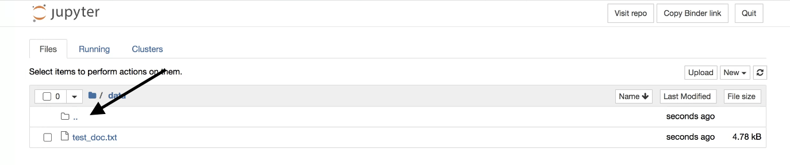
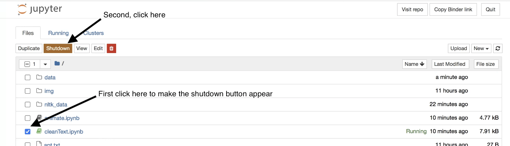
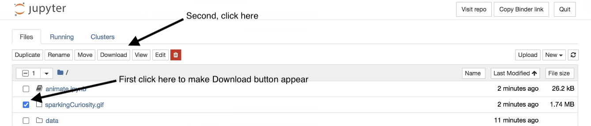
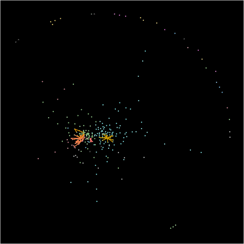
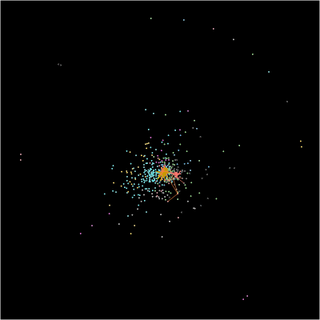

# Sparking Curiosity
Animate movement in word-vector similarity space

  

**Sparking Curiosity** 
Exhibited at [Reveal: The Art of Reimagining Scientific Discovery](https://www.american.edu/cas/museum/2021/reveal-scientific-discovery-kamen.cfm) 
Museum at the Katzen Arts Center, American University 
Created by [Dale Zhou](dalezhou.com), [David Lydon-Staley](https://www.asc.upenn.edu/people/faculty/david-lydon-staley-phd), [Perry Zurn](perryzurn.com), [Dani Bassett](https://complexsystemsupenn.com/personal) 
Organized and curated by [Rebecca Kamen](https://rebeccakamen.com/) and [Sarah Tanguy](https://sarahtanguy.com/) 

Sparking Curiosity was created to depict the network dynamics of [Rebecca Kamen](https://rebeccakamen.com/)'s art process. This network was created from transcribed interviews, where each circle represents a word describing an idea that shaped her artistic journey; and each line indicates how similar those words are to each other. The colors represent communities of ideas that are more alike. Every frame of the video summarizes the spark of hundreds of ideas and their immediate neighbors spoken during the interview. 

Visualizations of cognitive and language network methods from:
 * Lydon-Staley, D. M., Zhou, D., Blevins, A. S., Zurn, P., & Bassett, D. S. (2021). Hunters, busybodies and the knowledge network building associated with deprivation curiosity. *Nature Human Behaviour*, 5(3), 327-336. [https://doi.org/10.1038/s41562-020-00985-7](https://doi.org/10.1038/s41562-020-00985-7)

 * Zhou, D., Lydon-Staley, D. M., Zurn, P., & Bassett, D. S. (2020). The growth and form of knowledge networks by kinesthetic curiosity. *Current Opinion in Behavioral Sciences*, 35, 125-134. [https://doi.org/10.1016/j.cobeha.2020.09.007](https://doi.org/10.1016/j.cobeha.2020.09.007)

## Instructions

| Input                 | Output                                                                                                                        |
|-----------------------|-------------------------------------------------------------------------------------------------------------------------------|
| `.txt` file(s): Spoken, written, or surveyed words from interviews, essays, articles, or browsing data. No formatting necessary. | `sparkingCuriosity.gif`: Animation where each circle represents a word included in the `.txt` file; and each line indicates how similar those words are to each other (from pre-trained word2vec embeddings using Wikipedia data). The colors represent communities of words that are more alike. Every frame of the animation can summarize the spark of hundreds of words and their immediate neighbors.  |
| | `network.graphml`: standard network data file that can be used to visualize the static network with node labels |

1. Launch the coding environment 

2. Go to the `/data` folder and upload one or more `.txt` files containing the sequence of words that you want to animate dynamics atop a network made from those words. If uploading more than one file, note the script reads in the files in alphabetical order.

---

---

3. Go back to the first directory level, open, and run the notebook `cleanText.ipynb`

4. Go back to the first directory level and shutdown `cleanText.ipynb` after it finishes running (saves memory since notebooks will crash after 2 GB)

5. Open and run the code sections in `animate.ipynb`. You can change the number of frames (`break`), the speed (`interval`), and the image size and resolution (`ani.width`, `ani.height`, `res`).

6. Go back to the first directory level and save your animated network dynamics in .gif form. If you would like to visualize the static network using Gephi or other software, we also provide the network saved to `network.graphml` for download.

## Gallery

We welcome samples you'd liked displayed below! Please send to Dale Zhou (dalezhou [at] pennmedicine.upenn.edu).

  